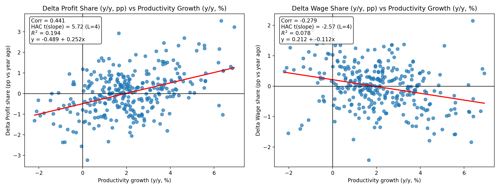
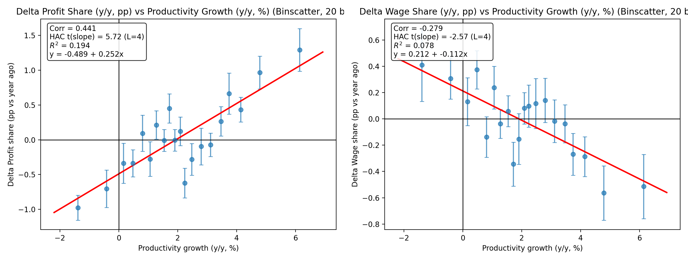

# Productivity and Factor Shares Replication Kit

This replication kit fetches FRED data, computes productivity growth and factor share transformations, runs OLS regressions with HAC standard errors, and generates publication-quality scatter plots.

## Variable Definitions

### Input Series (from FRED)

| Series ID | Source | Description | Units | Frequency | SA |
|-----------|--------|-------------|-------|-----------|-----|
| OPHNFB | BLS | Output Per Hour of All Persons, Nonfarm Business Sector | Index 2017=100 | Quarterly | Yes |
| GDP | BEA | Gross Domestic Product | Billions of Dollars | Quarterly | Yes |
| CPROFIT | BEA | Corporate Profits After Tax with Inventory Valuation Adjustment (IVA) and Capital Consumption Adjustment (CCAdj) | Billions of Dollars | Quarterly | Yes |
| COE | BEA | Compensation of Employees, Paid (wages, salaries, and employer contributions for employee benefit plans) | Billions of Dollars | Quarterly | Yes |

All series are fetched quarterly from the FRED API. The productivity series (OPHNFB) is available from 1947-present, while the national accounts series (GDP, CPROFIT, COE) are available from 1947-present. All series are seasonally adjusted at annual rates (SAAR) where applicable, ensuring comparability across quarters.

### Computed Variables

| Variable | Formula | Description |
|----------|---------|-------------|
| `prod_yoy_pct` | `100 * (ln(OPHNFB_t) - ln(OPHNFB_{t-4}))` | Year-over-year productivity growth (%) |
| `profit_share_pct` | `100 * CPROFIT / GDP` | Profit share of GDP (%) |
| `wage_share_pct` | `100 * COE / GDP` | Wage share of GDP (%) |
| `d_profit_share_yoy_pp` | `profit_share_pct - profit_share_pct.shift(4)` | Y/Y change in profit share (pp) |
| `d_wage_share_yoy_pp` | `wage_share_pct - wage_share_pct.shift(4)` | Y/Y change in wage share (pp) |

## Setup

### 1. Get a FRED API Key

1. Register at https://fred.stlouisfed.org/
2. Request an API key at https://research.stlouisfed.org/docs/api/api_key.html

### 2. Create Environment File

Create a `.env` file in the project root:

```
FRED_API_KEY=your_api_key_here
```

### 3. Install Dependencies

```bash
pip install -e ".[dev]"
```

Or install dependencies directly:

```bash
pip install pandas numpy requests statsmodels matplotlib Pillow python-dotenv pytest
```

## Usage

### Run the Complete Pipeline

```bash
python -m src.cli run-all
```

### Command-Line Options

```bash
python -m src.cli run-all --help
```

Options:
- `--no-network`: Use only cached data (no network requests)
- `--cache-dir DIR`: Directory for raw FRED data cache (default: `data/raw`)
- `--output-dir DIR`: Directory for processed data output (default: `data/processed`)
- `--figures-dir DIR`: Directory for figure outputs (default: `figures`)
- `--results-dir DIR`: Directory for regression results (default: `results`)

### Run Tests

```bash
pytest tests/ -v
```

## Output Files

### Data

- `data/raw/*.csv`: Cached FRED series data
- `data/raw/series_metadata.json`: FRED series metadata
- `data/processed/dshares_vs_prod.csv`: Main analysis dataset
- `data/processed/binscatter_*.csv`: Binscatter data

### Results

- `results/regression_summary.json`: Regression results in JSON format
- `results/regression_summary.csv`: Regression results in CSV format

### Figures

- `figures/scatter_profit_share.png`: Scatter plot for profit share
- `figures/scatter_wage_share.png`: Scatter plot for wage share
- `figures/scatter_combined.png`: Side-by-side scatter plots
- `figures/binscatter_profit_share.png`: Binscatter plot for profit share
- `figures/binscatter_wage_share.png`: Binscatter plot for wage share
- `figures/binscatter_combined.png`: Side-by-side binscatter plots

## Methodology

### Regression Specification

The analysis runs OLS regressions of factor share changes on productivity growth:

```
d_profit_share_yoy_pp = alpha + beta * prod_yoy_pct + epsilon
d_wage_share_yoy_pp = alpha + beta * prod_yoy_pct + epsilon
```

### HAC Standard Errors

Standard errors are computed using the Newey-West HAC estimator with 4 lags (approximately 1 year of quarterly data) to account for autocorrelation and heteroskedasticity.

### Binscatter

Binscatter plots divide the x-variable into 20 quantile bins and plot the mean of y within each bin, with error bars showing ±1 standard error.

## Results

### Main Findings

The analysis reveals a statistically significant relationship between productivity growth and changes in factor shares:

1. **Productivity gains increase profit shares**: A 1 percentage point increase in year-over-year productivity growth is associated with a 0.25 percentage point increase in the profit share of GDP.

2. **Productivity gains decrease wage shares**: The same 1 percentage point productivity increase corresponds to a 0.11 percentage point decrease in the wage share.

These results suggest that productivity gains disproportionately accrue to capital rather than labor, at least in the short run.

### Regression Results

| Dependent Variable | β (Slope) | HAC t-stat | R² | N |
|--------------------|-----------|------------|------|-----|
| Δ Profit Share (pp) | 0.25 | 5.72*** | 0.19 | 311 |
| Δ Wage Share (pp) | -0.11 | -2.57** | 0.08 | 311 |

*Notes: HAC standard errors with 4 lags. \*\*\* p < 0.01, \*\* p < 0.05*

### Figures

#### Scatter Plots with OLS Fit



The scatter plots show the raw quarterly data with OLS regression lines. The positive slope for profit share and negative slope for wage share are visually apparent.

#### Binscatter Plots



The binscatter plots group observations into 20 quantile bins of productivity growth and display the mean factor share change within each bin. Error bars show ±1 standard error. This visualization reduces noise and more clearly shows the underlying relationship.

## Project Structure

```
prod-wage-profits/
├── pyproject.toml          # Project configuration and dependencies
├── README.md               # This file
├── .gitignore              # Git ignore rules
├── .env                    # FRED API key (not tracked)
├── src/
│   ├── __init__.py
│   ├── fred_client.py      # FRED API client with caching
│   ├── build_dataset.py    # Data transformations
│   ├── analysis.py         # OLS regression with HAC
│   ├── plots.py            # Scatter and binscatter plots
│   └── cli.py              # Command-line interface
├── data/
│   ├── raw/                # Cached FRED data
│   └── processed/          # Processed analysis data
├── figures/                # Output plots
├── results/                # Regression results
└── tests/
    └── test_smoke.py       # Smoke tests
```
